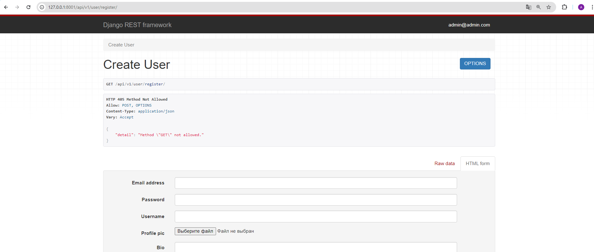
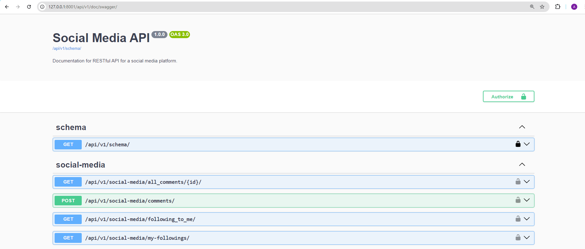
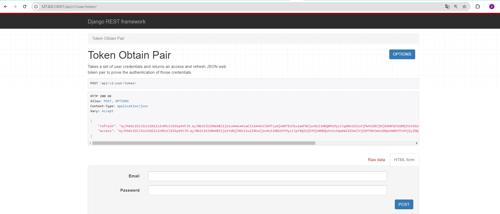
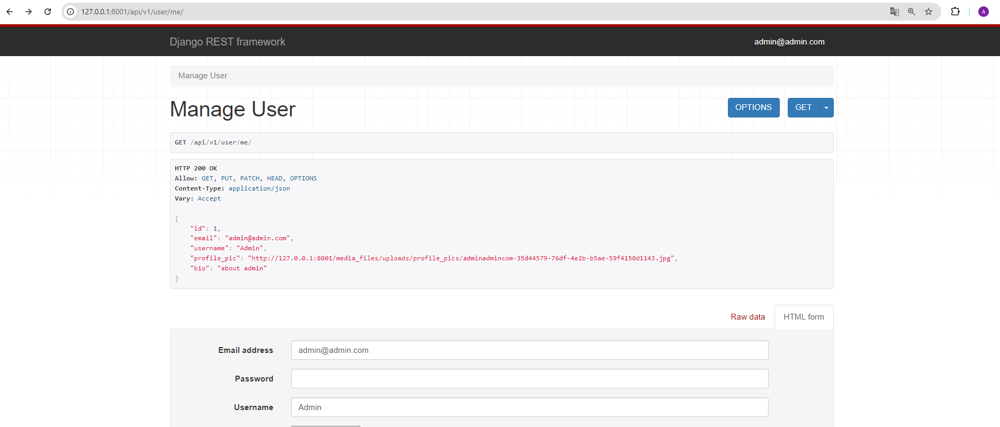
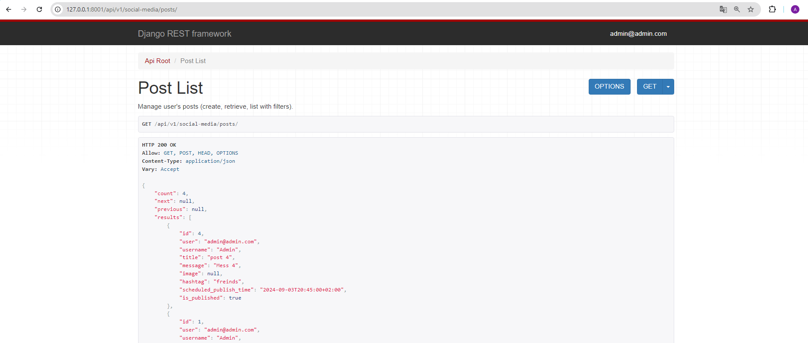
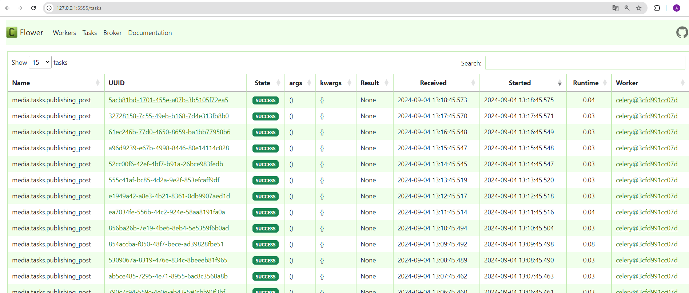

# social-media-api

API service for social media system written on DRF
(using  Django REST framework, Docker, Celery, Redis,
PostgreSQL, Flower)
in which Users can create profiles, follow other users,
create and retrieve posts, manage likes and comments, 
and perform basic social media actions. 

## Installing / Getting started

Python3 must be already installed
Docker must be already installed and running

```shell
git clone https://github.com/Anton-Konyk/social-media-api/
cd social-media-api
Python3 -n venv venv
source venv/bin/activate (for MacOS/Linux) or venv/scripts/activate (for Windows)
pip install -r requirenents.txt
create .env file (see example: [example.env](example.env) )
docker-compose build
docker-compose up
http://127.0.0.1:8001/api/v1/doc/swagger/  # API documentation

If you need create superuser account:
# After docker-compose up
docker exec -it social-media-api-social_media-1 bash
python manage.py createsuperuser
# after creating superuser
exit
http://127.0.0.1:8001/api/v1/user/register/


You need to visite to admin consol:
http://127.0.0.1:8001/admin/django_celery_beat/periodictask/
and add task periodic task media.task.publishing_post 
with your scheduler
```

## Features

* JWT authentication functionality for User (email and password for first registration)
* Service has permissions: If Authenticated, Is OwnerProfile Only
* Access for Django administration: http://127.0.0.1:8001/admin/
* Managing Profile with image, Post with image and with scheduled_publish_time,
  Comment, UserReaction by API
* App has filters for Profiles, Post, UserReaction for train facilities
* App gives information about capacity of train and quantity tickets for sale 
* User Registration and Authentication:
  Users can to register with their email and password to create an account.
  Users can to login with their credentials and receive an access and a refresh token for authentication.
  Users can to logout and invalidate their refresh token.
* User Profile:
  Users can to create and update their profile, including profile picture, bio, and other details.
  Users can to retrieve their own profile and view profiles of other users.
  Users can to search for users by username or other criteria.
* Follow/Unfollow:
  Users can to follow and unfollow other users.
  Users can to view the list of users they are following and the list of users following them.
* Post Creation and Retrieval:
  Users can to create new posts with text content and media attachments (e.g., images).
  Users can to retrieve their own posts and posts of users they are following.
  Users can to retrieve posts by hashtags or other criteria.
* Likes and Comments:
  Users can to like and unlike posts. 
  Users can to view the list of posts they have liked. 
  Users can to add comments to posts and view comments on posts.
* User can create Post with publishing time.
* You can see how publishing_post process is going (start every 1 minute)
  in Flower http://127.0.0.1:5555/tasks 

## Contributing

It's open source code.
If you'd like to contribute, please fork the repository and use a feature
branch. Pull requests are warmly welcome.


## Demo






